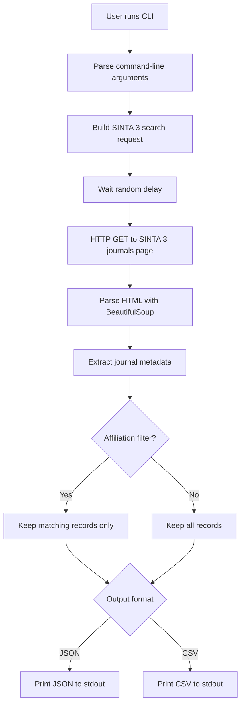

# SINTA 3 Journal Metadata CLI

[](LICENSE)
[](#installation)
[](README_ja.md)
<!-- Replace YOUR_DOI after creating the first GitHub Release and Zenodo DOI -->
[](https://doi.org/10.5281/zenodo.18908540)
A command-line tool for retrieving journal metadata from the Indonesian academic database **SINTA 3**.

Research tool for collecting Indonesian scholarly journal metadata from SINTA 3.

**English** / [Japanese](README_ja.md)

---

## Overview

This tool queries the SINTA journal search interface and extracts structured metadata such as journal title, SINTA level, ISSN, affiliation, citation counts, and H-index values.

Many older tools and code snippets still rely on the legacy SINTA 2 domain (`sinta.kemdikbud.go.id`). In contrast, this tool is designed for the current **SINTA 3** domain structure:

`https://sinta.kemdiktisaintek.go.id`

Because the underlying domain and page structure changed, older tools often no longer work reliably. This project aims to provide a practical and reusable research tool for the current SINTA environment. The Japanese draft materials and the current Python implementation provided by the author were used as the basis for this repository structure and documentation. 

---

## Features

- Compatible with **SINTA 3** (`sinta.kemdiktisaintek.go.id`)
- Keyword search for journals
- Search mode selection: title-only or broader search
- Affiliation filtering
- JSON / CSV output
- UNIX pipeline friendly (stdout-first design)
- Built-in randomized delay and browser-like User-Agent

The current script supports `-q/--query`, `-m/--mode`, `-a/--affil`, and `-f/--format`, and outputs either pretty-printed JSON or CSV to standard output. 

---

## Extracted Metadata

The script extracts the following fields from search results:

- `journal_name`
- `sinta_level`
- `p_issn`
- `e_issn`
- `affiliation`
- `sinta_score_3y`
- `sinta_score_overall`
- `h_index_google`
- `h_index_sinta`
- `citations_google`
- `citations_sinta`

These fields are visible in the current implementation where each journal result is normalized into a Python dictionary before output. 

---

## Architecture



---

## Installation

Python **3.9 or later** is recommended.

### 1. Clone the repository

```bash
git clone https://github.com/kimipooh/sinta-full-cli-v3
cd sinta-full-cli-v3
```

### 2. Create a virtual environment

```bash
python3 -m venv .venv
source .venv/bin/activate
```

### 3. Install dependencies

```bash
pip install -r requirements.txt
```

Or install them directly:

```bash
pip install requests beautifulsoup4
```

The current implementation imports `requests`, `beautifulsoup4`, `csv`, `json`, `argparse`, `sys`, `time`, `random`, and `re`; only `requests` and `beautifulsoup4` need to be installed separately. 

---

## Usage

### Show help

```bash
python sinta-full-cli-v3.py
```

### Basic search

```bash
python sinta-full-cli-v3.py -q "Engineering"
```

### Search titles only

```bash
python sinta-full-cli-v3.py -q "Computer Science" -m title
```

### Export CSV

```bash
python sinta-full-cli-v3.py -q "Physics" -f csv > results.csv
```

### Filter by affiliation

```bash
python sinta-full-cli-v3.py -q "AI" -a "Universitas"
```

### Search all fields and inspect the first result with jq

```bash
python sinta-full-cli-v3.py -q "Physics" -m all | jq '.[0]'
```

### Run directly as an executable

```bash
chmod +x sinta-full-cli-v3.py
./sinta-full-cli-v3.py -q "Engineering"
```

The examples above follow the same behavior described in the Japanese draft guide, now unified under the repository script name `sinta-full-cli-v3.py`. 

---

## Command-Line Arguments

| Option | Long option | Description |
|---|---|---|
| `-q` | `--query` | Search keyword |
| `-m` | `--mode` | Search mode: `title` or `all` |
| `-a` | `--affil` | Filter by affiliation / institution |
| `-f` | `--format` | Output format: `json` or `csv` |

These options match the current `argparse` configuration in the script. 

---

## Example Output

Example command:

```bash
python sinta-full-cli-v3.py -m title -q "Buletin ekonomi moneter dan perbankan" -f csv
```

Example output:

```csv
journal_name,sinta_level,p_issn,e_issn,affiliation,sinta_score_3y,sinta_score_overall,h_index_google,h_index_sinta,citations_google,citations_sinta
Buletin Ekonomi Moneter dan Perbankan,S1 Accredited,N/A,N/A,"Bank Indonesia Institute, Bank Indonesia",0,0,0,0,0,0
```

This example is adapted from the Japanese notes provided by the author. 

---

## Using with `jq`

Because the default output is JSON, the tool works well with `jq`.

### Show only the first result

```bash
python sinta-full-cli-v3.py -q "AI" | jq '.[0]'
```

### Count matched journals

```bash
python sinta-full-cli-v3.py -q "AI" | jq 'length'
```

### Show only S1 journals

```bash
python sinta-full-cli_v3.py -q "AI" | jq '.[] | select(.sinta_level == "S1")'
```

### List journal names only

```bash
python sinta-full-cli-v3.py -q "AI" | jq -r '.[].journal_name'
```

### Sort by overall score

```bash
python sinta-full-cli-v3.py -q "AI" | jq 'sort_by(.sinta_score_overall | tonumber) | reverse'
```

---

## Responsible and Ethical Use

This tool accesses publicly available search pages.

Please use it responsibly:

- A randomized delay is built in to reduce request bursts
- Avoid large-scale repeated queries
- If you encounter HTTP 403 responses, stop and wait before retrying
- Be aware that HTML structures may change and break selectors

The current code sleeps for a random interval before each request and uses a browser-like User-Agent string. 

---

## Limitations

- The tool currently scrapes the public journal search page
- HTML selectors may need updates if the SINTA layout changes
- The current approach is intentionally conservative and does not try to crawl all pages aggressively
- Search result pagination is not fully automated in the current workflow guidance because aggressive looping may increase the risk of IP blocking


---

## Academic Use

This tool was originally developed as a practical research utility for working with Indonesian scholarly journal data, especially where current SINTA 3-compatible tools are limited.

If you use this software in research, a citation to the repository or DOI is appreciated.

## DOI

This repository is archived on Zenodo.

https://doi.org/10.5281/zenodo.18908540

## Citation

If you use this software in your research, please cite:

Kitani, K. (2026).  
SINTA Data Retrieval Tool (Version 1.0).  
Zenodo. https://doi.org/10.5281/zenodo.18908540

---

## Files in This Repository

- `sinta-full-cli-v3.py` — main CLI script
- `README.md` — English documentation
- `README_ja.md` — Japanese documentation
- `LICENSE` — MIT License
- `requirements.txt` — Python dependencies

---

## Author

**Kimiya Kitani**  
Center for Southeast Asian Studies, Kyoto University

---

## License

MIT License  
Copyright (c) 2026 Kimiya Kitani
