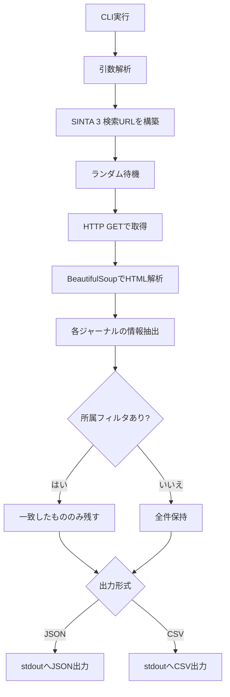

# SINTA 3 Journal Metadata CLI

[](LICENSE)
[](#installation)
[](README_ja.md)
[](https://doi.org/10.5281/zenodo.18908540)

インドネシアの学術データベース **SINTA 3** から、ジャーナル情報を取得して JSON または CSV として出力するコマンドラインツールです。

研究用途でのインドネシア学術ジャーナルメタデータ収集を意識して整備したツールです。

従来のツールの多くは旧ドメイン `sinta.kemdikbud.go.id` を前提としており、現在の **SINTA 3**（`sinta.kemdiktisaintek.go.id`）では動作しない、または不安定な場合があります。本ツールは、現在の SINTA 3 構造を前提にした実用的な研究用CLIとして整備したものです。 

**Japanese** | [English](README.md)


---

## 主な機能

- **SINTA 3** の現行ドメインに対応
- キーワード検索
- タイトル限定検索 / 全体検索の切り替え
- 発行元・所属機関での絞り込み
- JSON / CSV 出力
- 標準出力ベースでパイプ処理しやすい設計
- ランダムディレイと User-Agent による負荷配慮

現在のスクリプトでは、検索語、検索モード、所属フィルタ、出力形式を引数で指定できます。 

---

## 取得項目

以下のメタデータを取得します。

- `journal_name` : 雑誌名
- `sinta_level` : SINTAランク
- `p_issn` : Print ISSN
- `e_issn` : Electronic ISSN
- `affiliation` : 発行元・所属機関
- `sinta_score_3y` : 3年スコア
- `sinta_score_overall` : 総合スコア
- `h_index_google` : Google Scholar H-index
- `h_index_sinta` : SINTA H-index
- `citations_google` : Google Scholar 被引用数
- `citations_sinta` : SINTA 被引用数

これらは現行実装で辞書形式にまとめられて出力されています。 

---

## 処理の流れ



---

## インストール

Python **3.9以上** を推奨します。

### 1. リポジトリを取得

```bash
git clone https://github.com/kimipooh/sinta-full-cli-v3
cd sinta-full-cli-v3
```

### 2. 仮想環境を作成

```bash
python3 -m venv .venv
source .venv/bin/activate
```

### 3. 依存ライブラリをインストール

```bash
pip install -r requirements.txt
```

または直接インストール:

```bash
pip install requests beautifulsoup4
```

必要ライブラリは `requests` と `beautifulsoup4` です。 

このツールにインポートするライブラリは次の通り: `requests`, `beautifulsoup4`, `csv`, `json`, `argparse`, `sys`, `time`, `random`, `re`; `requests` と `beautifulsoup4` が追加で必要。

---

## 使い方

### ヘルプ表示

```bash
python sinta-full-cli-v3.py
```

### 基本検索

```bash
python sinta-full-cli-v3.py -q "Engineering"
```

### タイトルのみを検索

```bash
python sinta-full-cli-v3.py -q "Computer Science" -m title
```

### CSVで保存

```bash
python sinta-full-cli-v3.py -q "Physics" -f csv > results.csv
```

### 所属機関で絞り込み

```bash
python sinta-full-cli-v3.py -q "AI" -a "Universitas"
```

### `jq` と組み合わせて最初の1件を見る

```bash
python sinta-full-cli-v3.py -q "Physics" -m all | jq '.[0]'
```

### 実行権限を付けて直接実行

```bash
chmod +x sinta-full-cli-v3.py
./sinta-full-cli-v3.py -q "Engineering"
```

元の日本語資料で示されていた利用例を、スクリプト名 `sinta-full-cli-v3.py` に統一して整理しています。 

---

## 引数一覧

| 短縮 | 長い形式 | 説明 |
|---|---|---|
| `-q` | `--query` | 検索キーワード |
| `-m` | `--mode` | `title` または `all` |
| `-a` | `--affil` | 所属機関・発行元フィルタ |
| `-f` | `--format` | `json` または `csv` |

現行スクリプトの `argparse` 設定に対応しています。 

---

## 出力例

```bash
python sinta-full-cli-v3.py -m title -q "Buletin ekonomi moneter dan perbankan" -f csv
```

```csv
journal_name,sinta_level,p_issn,e_issn,affiliation,sinta_score_3y,sinta_score_overall,h_index_google,h_index_sinta,citations_google,citations_sinta
Buletin Ekonomi Moneter dan Perbankan,S1 Accredited,N/A,N/A,"Bank Indonesia Institute, Bank Indonesia",0,0,0,0,0,0
```

この例は元資料の出力例をもとに整理しています。

---

## `jq` を使った活用例

### 最初の1件だけ表示

```bash
python sinta-full-cli-v3.py -q "AI" | jq '.[0]'
```

### ヒット件数を数える

```bash
python sinta-full-cli-v3.py -q "AI" | jq 'length'
```

### S1の雑誌だけ抽出

```bash
python sinta-full-cli-v3.py -q "AI" | jq '.[] | select(.sinta_level == "S1")'
```

### 雑誌名だけ一覧表示

```bash
python sinta-full-cli-v3.py -q "AI" | jq -r '.[].journal_name'
```

### 総合スコア順に並べ替え

```bash
python sinta-full-cli-v3.py -q "AI" | jq 'sort_by(.sinta_score_overall | tonumber) | reverse'
```

---

## 責任ある倫理的な使用

このツールは、公開されている検索ページにアクセスします。  
責任を持ってご利用ください。

- 本ツールは公開検索ページをスクレイピングします
- ページ構造が変わるとセレクタ修正が必要になる場合があります
- 過度な連続アクセスは避けてください
- 403 Forbidden が出た場合は、一定時間アクセスを控えてください
- 大量ページを自動巡回する実装は、IPブロックのリスクが高まるため慎重に扱うべきです

現在のコードは、各リクエストの前にランダムな間隔でスリープし、ブラウザのような User-Agent 文字列を使用します。


## 制限事項

- このツールは現在、公開ジャーナル検索ページをスクレイピングしています。
- SINTAレイアウトが変更された場合、HTMLセレクターの更新が必要になる可能性があります。
- 現在のアプローチは意図的に保守的であり、すべてのページを積極的にクロールしようとはしません。
- 現在のワークフローガイダンスでは、検索結果のページネーションは完全に自動化されていません。積極的なループ処理はIPブロッキングのリスクを高める可能性があるためです。

---

## 学術研究利用について

このツールは、東南アジア地域の学術情報やジャーナルデータの収集・整理を支援する研究実務ツールとして開発したものです。特に、現行 SINTA 3 に対応した実用的ツールが限られている状況を踏まえ、再利用しやすい CLI として整備しています。


## DOI

This repository is archived on Zenodo.

https://doi.org/10.5281/zenodo.18908540

## Citation

このソフトウェアを研究で使用する場合は、リポジトリまたはDOIを引用していただけると幸いです。

Kitani, K. (2026).  
SINTA Data Retrieval Tool (Version 1.0).  
Zenodo. https://doi.org/10.5281/zenodo.18908540


## リポジトリ内ファイル

- `sinta-full-cli-v3.py` — メインのCLIスクリプト
- `README.md` — 英語版README
- `README_ja.md` — 日本語版README
- `LICENSE` — MIT License
- `requirements.txt` — 必要ライブラリ一覧

---

## Author

**Kimiya Kitani**  
Center for Southeast Asian Studies, Kyoto University

---

## License

MIT License  
Copyright (c) 2026 Kimiya Kitani
